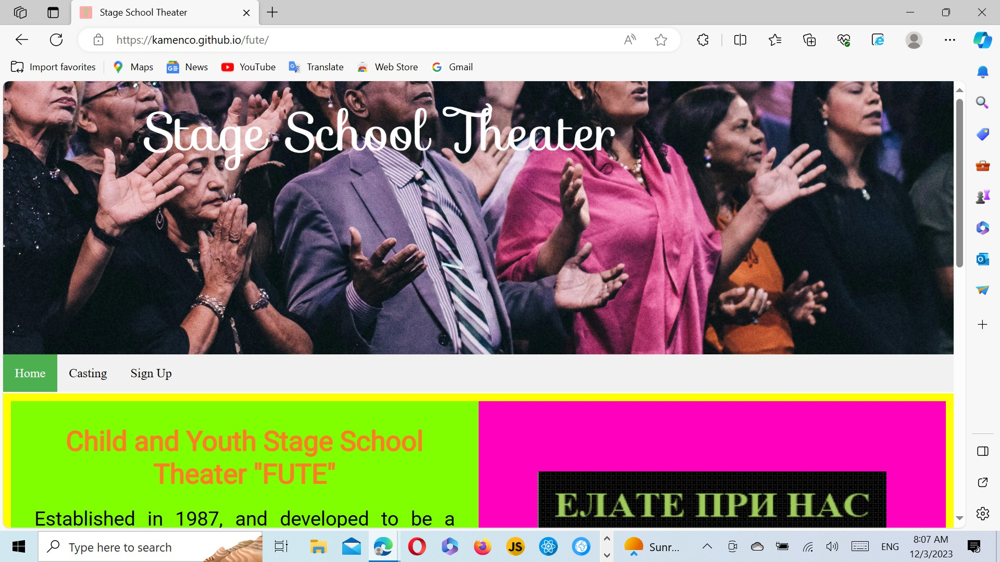

# Stage School Theater

Welcome! [School Stage Theater](https://kamenco.github.io/fute/)

## Introduction

This is a web site that engages with teaching children and youths the art of music, dance and drama. 

## Screenshots

There is a screenshot from from http://ami.responsivedesign.is 
Here is the result for responsiveness. https://ui.dev/amiresponsive?url=https://kamenco.github.io/fute/

Here is the printscreen image.

## Here are some screenshots of all the main fetures of the site

The home page index.html presents information about this school and its purpose, goal and achievements.
On the right-hand side there is a photo composition of young artists.

The second page casting.html gives information about the castings, and timetable with the casting dates as well as a gallery with photos of young artists performing on the scene. It provides data for contact and address.

The casting.html with the timetable.

The third page is a sign up page where the cutomers can fill the form with their details and submit the form.

## Testing

All pages have been tested manually with https://validator.w3.org for html and https://jigsaw.w3.org/css-validator/ for css. All pages passed all right.

While working on the gallery part a bug was found, the fifth picture didn't show properly. This bug was solved by clearing the flow after the fourth picture. 

There are no unfixed bugs.

The site was checked with lighthouse with following report:

Performance: 33

Accessibility 94

Best practices 95

SEO 92

The reason for the bad performance is probably the gallery. I think the site can get better performance if the gallery is on the whole page not on the half.

## Deployment

The site was deployed on the github.io First I opened the repository, from settings  I chose pages from Code and automation bar. Chose main branch and root folder. And then save.

## Credits

The code for the signup.html was taken from my Love Running project. The form is css validated with successful return of the input.

The code for the responsive navigation and the responsive gallery was learned from https://www.w3schools.com As the code for the gallery was modifies substantially.
All the images are taken from https://www.pexels.com and some were converted to .webp format using https://www.freeconvert.com 
The https://favicon.io/ was used for the icon in the browser tab.

This site was developped under the guidence of https://www.codeinstitute.net
Many thanks to all lecturers, tutors, facilitators, mentors and the slack community.

## Languages used

HTML, CSS. Hover CSS was used for the for the fields of the signup.html. The border changes to red while being hovered over. Google fonts are used "Roboto, sans-serif" throughout the project. Font awesome was used to add icons. Git Hub was used to store the projects code after being pushed from Git. 

Photoshop was used for the picture on the main page, Illustrator, Corel Draw and other similar programs have not been used.